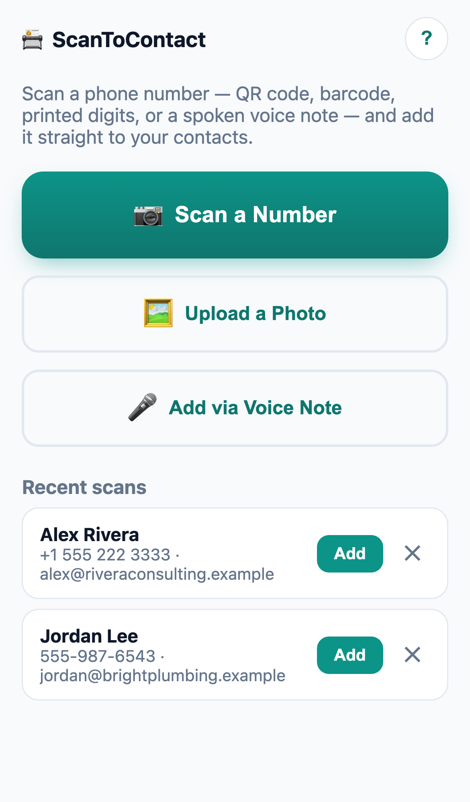
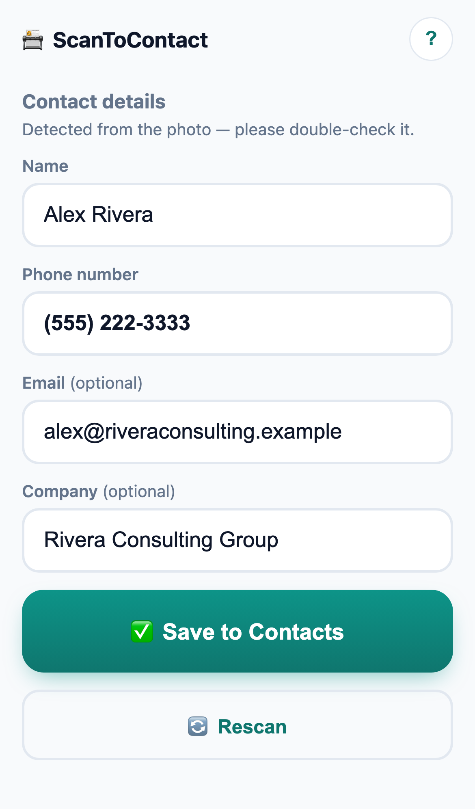
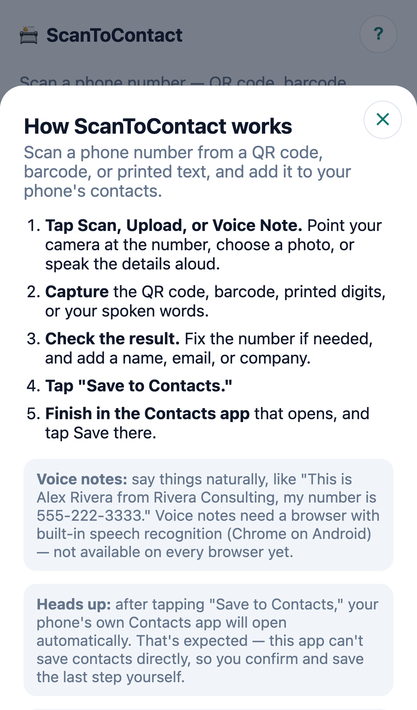

# ScanToContact

**Point your phone at a QR code, a barcode, printed text, or just talk — and
get a new contact ready to save.**

[](LICENSE)


No app to install from a store, no sign-up, no server, no data ever leaving
your phone. Open a link, scan or speak, and your phone's own Contacts app
opens with a new contact ready to review and save.

<p align="center">
  
  
  
</p>

## ✨ Features

- 📷 **Scan a QR code or barcode** — instant, using the browser's native
  scanner where available, with a fallback that works everywhere else
  (including iOS Safari).
- 🪪 **Scan a business card** — no barcode? OCR reads the printed text and
  guesses name, phone, email, *and* company from how the card is laid out.
- 🎤 **Or just say it** — "This is Alex Rivera from Rivera Consulting, my
  number is 555-222-3333" gets transcribed and parsed into the right fields
  (Android Chrome, for now).
- 🖼️ **Upload a photo** instead of using the live camera, any time.
- ✅ **Hands off to your phone's real Contacts app** — this app never writes
  to your address book directly; you always see and confirm the native "Add
  Contact" screen before anything is saved.
- 🔒 **100% on-device** — no backend, no account, nothing uploaded, ever.
- 📲 **Installable** — add it to your home screen on iOS or Android and it
  works offline after the first visit.

## 🚀 Quick start

```bash
npm install
npm run dev      # http://localhost:5173
```

Deploy the static build anywhere over HTTPS in one command:

```bash
npm run build
npx vercel --prod                       # or:
npx netlify-cli deploy --prod --dir=dist
```

See [Running locally](#running-locally) and [Building & deploying](#building--deploying)
below for the details that make a real difference on a phone (HTTPS for
camera access, testing the Contacts hand-off on a real device, etc.).

---

## Table of contents

- [How it works (the important part)](#how-it-works-the-important-part)
- [What gets scanned](#what-gets-scanned)
- [Running locally](#running-locally)
- [Building & deploying](#building--deploying)
- [Testing on a real device](#testing-on-a-real-device)
- [In-app help](#in-app-help)
- [Project structure](#project-structure)
- [Explicitly out of scope](#explicitly-out-of-scope)

## How it works (the important part)

There is no cross-platform web API that lets a website write directly into
the OS contacts database. The mechanism used here instead:

1. Build a **vCard** (`.vcf`) string from the scanned/edited fields.
2. Hand that vCard to the browser so the OS recognizes it and opens the
   native "Add Contact" screen, pre-filled and editable.
3. The user reviews and taps **Save** *in the Contacts app itself* — this app
   never writes to the address book directly.

**iOS Safari and Android Chrome need to be driven differently for step 2**
(see [`src/vcard.js`](src/vcard.js)):

| Platform | Technique | Why |
|---|---|---|
| iOS Safari | `window.location.href = 'data:text/vcard;charset=utf-8,' + encodeURIComponent(vcard)` (navigate the current tab) | This is what reliably surfaces the native contact-card preview sheet on iOS. A Blob + `<a download>` is instead treated as a plain file download into the Files app. |
| Android Chrome (and everything else) | `Blob` + `URL.createObjectURL` + an `<a download="contact.vcf">` that gets `.click()`ed | Chrome downloads the `.vcf`; tapping the resulting download notification/file is what launches the Contacts app's import screen. A `data:` URI navigation on Chrome does not trigger the same hand-off. |

The app picks a branch using `navigator.userAgent`/`navigator.platform`
(`isIOS()` in `src/vcard.js`), including the iPadOS 13+ case where Safari
reports itself as `MacIntel`.

⚠️ **This is the part that most needs real-device verification.** A desktop
browser or simulator cannot validate it — Chromium's own handling of a
`data:` URI with a non-renderable MIME type (like `text/vcard`) is to trigger
a download rather than a preview, which is *not* the same as what WebKit does
on a real iPhone. Automated testing in this repo confirmed the branching
logic picks the correct code path per platform and that the vCard content
itself is well-formed (see `BEGIN:VCARD` / `FN` / `TEL` / `EMAIL` / `ORG` /
`END:VCARD`, CRLF line endings, proper escaping) — but the actual OS hand-off
can only be confirmed by opening the deployed HTTPS URL on:

- **A real iPhone, in Safari** — tap Scan → capture/scan a number → Save to
  Contacts, and confirm the native "New Contact" preview appears instead of a
  file landing in the Files app.
- **A real Android phone, in Chrome** — same flow, and confirm tapping the
  download notification (or the in-browser download tray) opens the
  Contacts app's "Create contact" screen instead of just leaving a `.vcf` in
  Downloads with no further action.

If either platform's behavior has drifted (browsers do change this over
time), the fix is isolated to `triggerAddToContacts()` in `src/vcard.js`.

## What gets scanned

- **QR codes / barcodes** are tried first, via the native `BarcodeDetector`
  API where available (Chrome/Android) and via `@zxing/library` everywhere
  else (iOS Safari, older browsers). Recognized payload shapes:
  - `tel:` and `mailto:` URIs
  - `MECARD:...` (name, phone, email)
  - `BEGIN:VCARD...END:VCARD` (name, phone, email, organization)
  - Plain text containing a phone number and/or email
- **Printed text** (e.g. a business card) is the fallback when no barcode is
  found: the captured frame is OCR'd with `tesseract.js`, and:
  - a phone-number-shaped digit run and an email address are pulled out with
    regexes (tolerant of spaces/dashes/parentheses/dots);
  - a name and company are guessed heuristically from the remaining lines,
    using each OCR'd line's printed height as a stand-in for font size (the
    name and company are usually the most prominent text on a card), while
    excluding lines that look like a job title, street address, website, or
    the phone/email line already extracted (`extractNameAndOrgFromLines` in
    `src/scanner.js`).
  - Unlike a barcode's structured fields, this is inherently a best-effort
    guess — there's no way to be certain a line of text is a name vs. a
    slogan. It's deliberately biased toward guessing rather than leaving
    fields blank, since a wrong guess is a quick edit but a blank field is
    manual typing.
- **Voice notes**: tap "Add via Voice Note" and speak the details naturally,
  e.g. *"This is Alex Rivera from Rivera Consulting, my number is
  555-222-3333."* The browser's built-in speech recognition
  (`SpeechRecognition` / `webkitSpeechRecognition`) transcribes it live —
  shown in an editable "what we heard" box — and phrasing patterns pull out
  name, company, phone, and email (`src/voice.js`). This is **Android Chrome
  only for now**: iOS Safari has never implemented the Web Speech API, and
  there's no cross-platform fallback the way there is for barcodes (a
  fallback would mean bundling a full speech-to-text model, tens of MB, just
  for this one feature — deferred as a deliberate size/scope tradeoff). On
  unsupported browsers the button is hidden and a short note explains why.
  Two known limitations, both inherent to free-form speech rather than bugs:
  - Recognition patterns are English phrasing only ("my name is...", "I work
    at...", "from...", "with...").
  - A dictated email works when spoken as a single fluid word-run ("alex at
    example dot com"), but a multi-word company domain spoken with a natural
    pause ("alex at rivera consulting dot com" meaning `riveraconsulting.com`)
    won't be reliably assembled — edit the email field by hand in that case.
- Every field (name, phone, email, company) is shown in an editable form
  before anything is saved — nothing is sent to Contacts without you seeing
  and being able to correct it first.

## Running locally

```bash
npm install   # also runs postinstall: generates icons + copies OCR/barcode assets locally
npm run dev   # starts Vite on http://localhost:5173
```

`npm install`'s `postinstall` step does two things automatically:
- Generates the two placeholder app icons (`public/icons/icon-192.png`,
  `icon-512.png`) — a small script-drawn phone glyph, no external tools
  required. Swap these for real artwork whenever you like; just keep the
  same filenames/sizes or update `public/manifest.json`.
- Copies the `tesseract.js` worker, WASM core, and English trained-data file
  out of `node_modules` into `public/tesseract/` and `public/tessdata/`, so
  OCR assets are served as plain static files (needed so the service worker
  can precache them for offline use) instead of being fetched from a CDN at
  runtime.

**Camera access requires a secure context.** `localhost` counts as secure, so
`npm run dev` works fine for UI/logic testing on your own machine. To test the
camera from an actual phone during development, you need HTTPS — either:
- deploy a preview build (see below), or
- tunnel your local dev server over HTTPS (e.g. `ngrok http 5173` or a
  Cloudflare Tunnel), or
- run Vite with a local HTTPS cert (e.g. via `mkcert`) and pass `--host`.

Plain `http://<your-lan-ip>:5173` will **not** get camera access on a real
phone — only `localhost` and HTTPS origins are treated as secure contexts.

## Building & deploying

```bash
npm run build     # outputs static files to dist/
npm run preview   # serve the production build locally, for a final check
```

`dist/` is a fully static site — deploy it anywhere that serves static files
over HTTPS.

**Vercel** (one command, from the project root):
```bash
npx vercel --prod
```

**Netlify** (one command, from the project root):
```bash
npx netlify-cli deploy --prod --dir=dist
```

Both platforms serve over HTTPS by default, which is required for camera
access and recommended for service workers.

## Testing on a real device

1. Deploy (above) or tunnel your dev server over HTTPS.
2. Open the HTTPS URL on the phone.
3. **Camera + detection**: tap Scan, grant camera permission, point at a QR
   code / barcode / printed number. Confirm the live view auto-detects
   barcodes, and that the Capture button + OCR fallback works when you point
   at printed digits with no barcode nearby.
4. **The vCard hand-off** (see the table above — do this on both an iPhone
   and an Android phone, they behave differently):
   - Fill in Name / Phone / Email / Company as needed, tap **Save to
     Contacts**.
   - **iOS**: confirm Safari shows the native "New Contact" preview card,
     pre-filled, with a Save/Cancel action — not a file download.
   - **Android**: confirm a `contact.vcf` download completes, and that
     opening it (from the download notification, browser download tray, or
     Files app) launches the Contacts app's "Create contact" screen,
     pre-filled.
5. **Voice notes (Android Chrome only)**: tap "Add via Voice Note," grant
   microphone permission, and speak a contact naturally (see the example
   phrasing above). Confirm the live transcript appears as you talk, and that
   "Done" extracts sensible name/phone/email/company. On iPhone, confirm the
   button is hidden and the explanatory note appears instead.
6. **Install / offline**: add the app to the home screen (see below), then
   turn on airplane mode and relaunch it from the home screen — the scanner
   UI should still load (camera obviously won't work offline, but the shell,
   OCR engine, and barcode engine are cached from the first visit).

### Add to Home Screen

- **iOS**: Safari → Share icon → "Add to Home Screen." iOS has no automatic
  install prompt, so the in-app help modal (see below) surfaces this
  explicitly on first launch.
- **Android**: Chrome menu (⋮) → "Add to Home screen" / "Install app," or the
  install icon in the address bar if Chrome offers it automatically.

## In-app help

A "?" button (top-right, always visible) opens a short "How it works" modal:
what the app does, the 5-step flow, an explicit note that tapping "Save to
Contacts" opens your phone's own Contacts app (expected, not a bug), a
platform-appropriate "Add to Home Screen" tip, and a privacy note (everything
is on-device). It only opens when the user taps the "?" icon — it does not
appear automatically.

## Project structure

```
index.html              app shell / all screens (home, camera, processing, result)
src/main.js              screen flow, wiring, history rendering, service worker registration
src/scanner.js           camera, barcode detection (BarcodeDetector + zxing fallback), OCR, field extraction
src/vcard.js             vCard building + the iOS/Android hand-off branching
src/history.js           localStorage-backed recent-scans safety net
src/help.js               on-demand help modal (opened via the "?" button)
src/voice.js              voice-note capture (Web Speech API) + spoken-text field extraction
src/style.css            all styling (mobile-first, light/dark)
public/manifest.json     PWA manifest
public/sw.js             hand-written service worker (precache shell + cache-as-you-go for the rest)
scripts/generate-icons.mjs    generates public/icons/*.png (no external tools needed)
scripts/copy-ocr-assets.mjs   copies tesseract.js's worker/core/lang files into public/ for offline use
```

## Explicitly out of scope

- No backend, database, or user accounts.
- No silent/direct writing into the OS contacts database — the user always
  sees and confirms in the native Add Contact screen.
- No native app / app store packaging — this is a browser-only PWA.

## License

[MIT](LICENSE)
